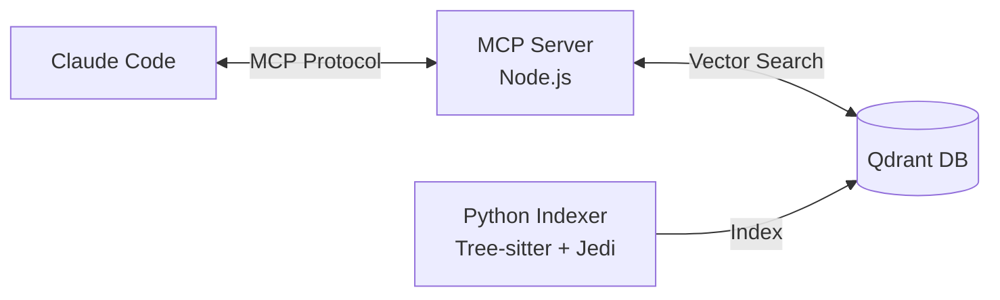

# CLAUDE.md - Developer Guide

> **v2.8** | Claude Code Memory - Semantic code memory for Claude Code

This file provides guidance to Claude Code when working with code in this repository.

---

## 📚 Documentation

| Document | Description |
|----------|-------------|
| [README.md](README.md) | Project overview and quick start |
| [ARCHITECTURE.md](ARCHITECTURE.md) | System design with mermaid diagrams |
| [CHANGELOG.md](CHANGELOG.md) | Version history and migration notes |
| [docs/CLI_REFERENCE.md](docs/CLI_REFERENCE.md) | Complete CLI command reference |
| [docs/HOOKS.md](docs/HOOKS.md) | Claude Code hooks system |
| [docs/MEMORY_GUARD.md](docs/MEMORY_GUARD.md) | Code quality enforcement (27 checks) |
| [docs/UI_CONSISTENCY_GUIDE.md](docs/UI_CONSISTENCY_GUIDE.md) | UI consistency checking guide |
| [docs/UI_CI_SETUP.md](docs/UI_CI_SETUP.md) | CI integration for UI quality gates |
| [docs/UI_METRICS.md](docs/UI_METRICS.md) | Metrics dashboard and success tracking |

---

## 🧪 Testing

**CLI Validation:**
```bash
claude-indexer index/watch/service --verbose
```

**Integration Tests:**
```bash
pytest tests/integration/test_index_check_complete.py -v -s -x
# Logs: isolated_test/logs/parser-test.log

# With watcher:
pytest tests/integration/test_index_check_complete.py -v -s -x --watcher
# Logs: isolated_test/logs/parser-test-watcher.log
```

**Project indexing logs:** `logs/[collection-name].log`

---

## 🏗️ Git Structure

The project has 3 git repositories:
1. **Main project root** - Primary codebase
2. **tests/** - Independent git for test changes
3. **mcp-qdrant-memory/** - Node.js MCP server component

---

## ⚠️ Debug Environment

**CRITICAL: Use `debug/` folder for ALL test scripts and databases.**

- Create test scripts in `debug/` only (never in project root)
- Use `debug/test_collections/` for test database collections
- Test files in `debug/` are automatically git-ignored
- Never contaminate production collections with test data

---

## Architecture Overview



**Components:**
- **Python Indexer** (`claude_indexer/`) - Universal AST parsing and vector indexing
- **Node.js MCP Server** (`mcp-qdrant-memory/`) - Memory retrieval interface for Claude
- **Qdrant Vector Database** - Semantic search and storage backend

## Essential Commands

### Development Setup
```bash
# Environment setup
python3.12 -m venv .venv && source .venv/bin/activate
pip install -r requirements.txt

# Install global wrapper
./install.sh

# Start Qdrant database
docker run -p 6333:6333 -v $(pwd)/qdrant_storage:/qdrant/storage qdrant/qdrant
```

### Build and Quality
```bash
# Code formatting and linting
black .
isort .
flake8 .
mypy claude_indexer/

# Testing
pytest                     # All tests
pytest tests/unit/         # Unit tests only
pytest tests/integration/  # Integration tests
pytest --cov=claude_indexer --cov-report=html  # With coverage
```

### Indexing and Memory Operations
```bash
# Index project (auto-detects incremental mode)
claude-indexer index -p /path/to/project -c collection-name

# Batch indexing from stdin (4-15x faster for git hooks)
echo "src/auth.py
src/api/users.py" | claude-indexer index -p . -c my-project --files-from-stdin

# Real-time file watching
claude-indexer watch start -p /path -c collection-name

# Search semantic code
claude-indexer search "query" -p /path -c collection-name

# Service management for multiple projects
claude-indexer service start
claude-indexer service add-project /path project-name
```

### MCP Server Configuration
```bash
# Automatic MCP setup (reads settings.txt)
claude-indexer add-mcp -c collection-name
```

**⚠️ Project Memory:** Use `mcp__claude-memory-memory__` prefix for all memory operations on this project.

**🧪 Testing:** Use `parser-test-memory` MCP for isolated testing without contaminating production collections.

**🔑 API Configuration:** OpenAI and Voyage AI keys configured in `settings.txt` for cleanup scoring and embeddings. Contains active API keys for GPT-4.1-mini scoring and Voyage AI embedding generation.

### UI Consistency Tools

```bash
# Pre-commit guard (Tier 0: <300ms)
claude-indexer ui-guard src/components/Button.tsx

# CI audit with SARIF output (Tier 1: <10min for 1000 files)
claude-indexer quality-gates run ui --format sarif -o results.sarif

# Design critique command (Tier 2: <5min focused audit)
claude-indexer redesign --focus "button components"

# View/update baseline
claude-indexer quality-gates baseline show
claude-indexer quality-gates baseline update

# Metrics dashboard (Phase 9)
claude-indexer quality-gates metrics show
claude-indexer quality-gates metrics history --days 30
claude-indexer quality-gates metrics export metrics.json
```

**Three-Tier System:**
- **Tier 0** (Pre-commit): <300ms p95, catches token drift and new violations
- **Tier 1** (CI Audit): <10min for 1000+ files, cross-file duplicate detection
- **Tier 2** (/redesign): <5min focused audit with actionable recommendations

**Quick Reference:**
| Command | Purpose |
|---------|---------|
| `ui-guard` | Fast pre-commit check for changed files |
| `quality-gates run ui` | Full CI audit with SARIF export |
| `redesign` | On-demand design critique |
| `quality-gates baseline` | Manage baseline issues |
| `quality-gates metrics` | View/export metrics dashboard |

See [UI Consistency Guide](docs/UI_CONSISTENCY_GUIDE.md) for complete documentation.

## Key Architecture Components

### Core Indexing Engine
- **Entry Point**: `claude_indexer/cli_full.py` (Click-based CLI)
- **Main Logic**: `claude_indexer/main.py` and `CoreIndexer` (`indexer.py`)
- **Global Command**: `claude-indexer` (installed via `./install.sh`)

### Multi-Language Analysis
- **Parser Registry**: `claude_indexer/analysis/parser.py` (Tree-sitter + Jedi)
- **Supported Languages**: Python, JavaScript/TypeScript, JSON, YAML, HTML, CSS, Markdown
- **Language Parsers**: Individual parsers in `claude_indexer/analysis/` (e.g., `python_parser.py`, `javascript_parser.py`)

### Storage and Embeddings
- **Storage**: `claude_indexer/storage/qdrant.py` (Direct Qdrant integration)
- **Embeddings**: `claude_indexer/embeddings/` (OpenAI + Voyage AI support)
- **Configuration**: `claude_indexer/config/` (Hierarchical project settings)

### Progressive Disclosure System
- **Metadata Chunks**: Fast entity overviews (90% speed boost)
- **Implementation Chunks**: Detailed code content on-demand
- **Entity-Specific Filtering**: Focus on specific components vs. entire project graphs

## Configuration
Use `§m` to search memory for detailed configuration patterns, file organization, and advanced command usage.

## Memory Integration

### Enhanced 9-Category System for Manual Entries

**Research-backed categorization with semantic content analysis:**

- **`debugging_pattern` (30% target)**: Investigation techniques and system analysis methods
- **`implementation_pattern` (25% target)**: Code patterns, algorithms, best practices
- **`integration_pattern` (15% target)**: APIs, databases, authentication, pipelines
- **`configuration_pattern` (12% target)**: Environment setup, deployment, CI/CD
- **`architecture_pattern` (10% target)**: System design, component structure
- **`performance_pattern` (8% target)**: Optimization, caching, bottlenecks
- **`knowledge_insight`**: Research findings, lessons learned, methodology
- **`active_issue`**: Current development tasks and user-reported issues requiring attention
- **`ideas`**: Project ideas, feature suggestions, future enhancements, brainstorming

## Memory Storage Rules
***Store system knowledge, patterns, and insights - NOT bug history or fix records***

**What TO store:**
- Code flow patterns and system understanding
- Debugging techniques and investigation methods  
- Function relationships and architecture insights
- Better coding practices learned

**What NOT to store:**
- Bug descriptions or that bugs existed
- Fix history or "resolved" status
- Problem-solution pairs from specific incidents

**Classification Approach**: Analyze content semantics, not format. Identify 3 strongest indicators, then categorize based on actual problem domain rather than documentation style.

### 🎯 Unified entityTypes Filtering (NEW)

**Single parameter supports both entity types and chunk types with OR logic:**

**Entity Types**: `class`, `function`, `documentation`, `text_chunk`, `relation`
**Chunk Types**: `metadata`, `implementation`

**Usage Examples:**
```python
# Filter by entity types only
search_similar("pattern", entityTypes=["function", "class"])

# Filter by chunk types only
search_similar("pattern", entityTypes=["metadata"])        # Fast search
search_similar("pattern", entityTypes=["implementation"])  # Detailed code

# Filter relations for code architecture analysis
search_similar("import patterns", entityTypes=["relation"])  # Find code dependencies

# Mixed filtering (OR logic)
search_similar("pattern", entityTypes=["function", "metadata", "implementation"])

# All types (no filtering)
search_similar("pattern")  # Returns all entity and chunk types
```

**Benefits:**
- **Single Parameter**: No need for separate `chunkTypes` parameter
- **OR Logic**: Mixed arrays return results matching ANY specified type
- **Backward Compatible**: Existing calls work unchanged
- **Performance**: Filter at database level for optimal speed

## 🔍 BM25 Keyword & Hybrid Search (NEW v2.8)

**Search Modes:** `hybrid` (default), `semantic`, `keyword`

```python
search_similar("function name", searchMode="hybrid")    # Best of both worlds
search_similar("exact terms", searchMode="keyword")     # BM25 term matching  
search_similar("concept query", searchMode="semantic")  # AI understanding only
```

## Virtual Environment Usage

**Always activate venv before testing:**
```bash
source .venv/bin/activate  # Required before pytest
pytest                     # Now runs with correct dependencies
```

## Direct Qdrant Access

**Bypass MCP for database operations:**
```bash
python utils/qdrant_stats.py              # Collection health
python utils/find_missing_files.py        # File sync debug
python utils/manual_memory_backup.py      # Backup/restore
```

**Test Qdrant connection:**
```bash
# Test using config loader (loads settings.txt properly)
python3 -c "from claude_indexer.config.config_loader import ConfigLoader; from qdrant_client import QdrantClient; config=ConfigLoader().load(); client=QdrantClient(url=config.qdrant_url, api_key=config.qdrant_api_key); print('Collections:', [c.name for c in client.get_collections().collections])"
```

## Debug Testing Protocol

**Testing Database - watcher-test Collection:**
```bash
# Use dedicated test collection for all debugging (never use production DB)
claude-indexer index -p /path/to/test-files -c watcher-test --verbose
```

**Testing Best Practices:**
- Always use separate test collections (watcher-test, debug-test) for debugging
- Use 1-2 Python files only for cleaner debug output
- Never contaminate production memory collections during testing
- Test indexing, relations, file processing, incremental updates, parser functionality
- MCP server already configured for watcher-test collection

## Manual Memory Backup & Restore

Protect your valuable manual memories (analysis notes, insights, patterns):

```bash
# Backup all manual entries from a collection
python utils/manual_memory_backup.py backup -c collection-name

# Generate MCP restore commands for manual entries
python utils/manual_memory_backup.py restore -f manual_entries_backup_collection-name.json

# Execute restore directly to Qdrant with vectorization (uses original collection from backup)
python utils/manual_memory_backup.py restore -f manual_entries_backup_collection-name.json
# Or specify different target collection
python utils/manual_memory_backup.py restore -f manual_entries_backup_collection-name.json -c target-collection

# Dry run to see what would be restored
python utils/manual_memory_backup.py restore -f backup.json --dry-run
```


## 🎯 Entity-Specific Graph Filtering (NEW in v2.7)

**Focus on specific entities instead of browsing entire project graphs:**

```python
# Focus on specific function's dependencies and usage
read_graph(entity="AuthService", mode="smart")
# Returns: AI summary of AuthService's connections, dependencies, usage

# See all relationships for a specific entity
read_graph(entity="process_login", mode="relationships")
# Returns: Only relations involving process_login (incoming/outgoing)

# Get entities connected to a specific component
read_graph(entity="validate_token", mode="entities")
# Returns: All entities that connect to validate_token

# Raw data for a specific entity's network
read_graph(entity="DatabaseManager", mode="raw")
# Returns: Complete entities + relations for DatabaseManager's network
```

## 🔧 Enhanced Debugging Workflow with Unified Filtering (v2.8)

**Modern Memory-First Debugging Approach - Leveraging unified entityTypes for 90% faster problem resolution:**

### Phase 1: Smart Error Discovery
```python
# 🎯 Fast metadata scan for initial triage (90% speed boost)
search_similar("error pattern", entityTypes=["metadata"])

# 🔍 Find similar debugging patterns from past solutions  
search_similar("authentication error", entityTypes=["function", "debugging_pattern"], searchMode="hybrid")

# 🧩 Mixed search for comprehensive context
search_similar("validation error", entityTypes=["function", "metadata", "implementation"])
```

### Phase 2: Targeted Problem Analysis
```python
# 1. Focus on specific problematic function
read_graph(entity="validate_token", mode="smart")         # AI summary with stats
get_implementation("validate_token", scope="logical")    # Function + helpers
get_implementation("validate_token", scope="dependencies") # Full dependency chain

# 2. Trace error propagation paths
read_graph(entity="handle_request", mode="relationships")
# Shows: incoming calls, outgoing calls, error flow

# 3. Understand class/module architecture
read_graph(entity="AuthService", mode="entities")
# Shows: all connected components
```

### Phase 3: Solution Implementation
```python
# 🎯 Find existing patterns before implementing
search_similar("input validation", entityTypes=["implementation_pattern", "function"])

# 📚 Check documentation for API usage
search_similar("authentication api", entityTypes=["documentation"])

# 🔧 Deep dive into implementation details when needed
search_similar("complex validation logic", entityTypes=["implementation"])
```

### Best Practices for Memory-First Debugging:

1. **Start Fast**: Always begin with `entityTypes=["metadata"]` for quick overview
2. **Use Patterns**: Search `debugging_pattern` category for similar past issues
3. **Progressive Depth**: metadata → function/class → implementation
4. **Store Solutions**: Document fixes as `implementation_pattern` for future reference
5. **Leverage OR Logic**: Mix types like `["function", "metadata"]` for flexible search

### Performance Tips:
- **Metadata-first**: 3.99ms vs traditional full search
- **Targeted Filtering**: Reduce noise by 85% with specific entityTypes
- **Entity-Specific**: 10-20 relevant items vs 300+ unfiltered results
- **Smart Caching**: Frequently accessed patterns cached automatically

**Performance Benefits:**
- **10-20 focused relations** instead of 300+ scattered ones
- **Smart entity summaries** with key statistics and relationship breakdown
- **Laser-focused debugging** without information overload
- **Backward compatible** - general graph still works without entity parameter

## 🚀 Advanced Implementation Workflow with Unified Filtering

**Efficient Code Implementation Using Memory-First Approach:**

### Phase 1: Pre-Implementation Research
```python
# 🔍 Check if similar functionality exists (avoid duplication)
search_similar("user authentication", entityTypes=["function", "class", "implementation_pattern"])

# 📚 Find relevant documentation and guides
search_similar("auth library usage", entityTypes=["documentation"])

# 🎯 Look for existing patterns and best practices
search_similar("auth pattern", entityTypes=["implementation_pattern", "architecture_pattern"])
```

### Phase 2: Architecture Understanding
```python
# Understand module dependencies before adding new code
read_graph(entity="AuthModule", mode="smart")           # Overview with stats
read_graph(entity="AuthModule", mode="relationships")   # See all connections

# Check existing implementations for consistency
get_implementation("similar_function", scope="logical")  # Understand code style
```

### Phase 3: Smart Implementation
1. **Always search first**: Use memory to find existing solutions
2. **Follow patterns**: Maintain consistency with existing architecture
3. **Progressive disclosure**: Start with metadata, dive deeper as needed
4. **Document patterns**: Store successful implementations for future use

## Debug Commands

**CLI Debugging:**
```bash
claude-indexer -p /path -c collection --verbose    # Detailed error messages
claude-indexer service status --verbose            # Service debugging
claude-indexer search "query" -p /path -c test     # Test search functionality
```

**Log Analysis:**
```bash
tail -f logs/collection-name.log                   # Real-time monitoring
tail -f ~/.claude-indexer/logs/service.log        # Service logs
```

**Claude Code MCP Logs:**
```bash
# MCP server logs for all servers
~/Library/Caches/claude-cli-nodejs/

# Project-specific MCP logs (replace PROJECT_PATH with actual path)
~/Library/Caches/claude-cli-nodejs/-PROJECT_PATH--claude/mcp-logs-[server-name]/

# Memory project MCP logs 
tail -f ~/Library/Caches/claude-cli-nodejs/-Users-Duracula-1-Python-Projects-memory--claude/mcp-logs-claude-memory-memory/$(ls -t ~/Library/Caches/claude-cli-nodejs/-Users-Duracula-1-Python-Projects-memory--claude/mcp-logs-claude-memory-memory/ | head -1)
```

**After MCP changes:** Build and restart with:
```bash
cd mcp-qdrant-memory && npm run build && pkill -f node && rm -rf ~/Library/Caches/claude-cli-nodejs/
```
Then restart Claude Code.

**Collection Health:**
```bash
python utils/qdrant_stats.py                      # Collection statistics
python utils/find_missing_files.py                # File sync debugging
```

## Basic Troubleshooting

**Qdrant Connection Failed:**
- Ensure Qdrant is running on port 6333
- Check firewall settings
- Verify API key matches
- Use `search_similar("qdrant connection error", entityTypes=["debugging_pattern"])` for solutions

**MCP Server Not Loading:**
- Restart Claude Code after config changes
- Check absolute paths in MCP configuration
- Search memory: `search_similar("mcp configuration", entityTypes=["configuration_pattern"])`

**No Entities Created:**
- Verify target directory contains supported files (Python, JavaScript, TypeScript, JSON, HTML, CSS, YAML, etc.)
- Use `--verbose` flag for detailed error messages
- Check memory: `search_similar("indexing error no entities", entityTypes=["debugging_pattern", "metadata"])`

---

## 📖 Additional Resources

**Documentation:**
- [CLI Reference](docs/CLI_REFERENCE.md) - Complete command documentation
- [Hooks System](docs/HOOKS.md) - Claude Code integration hooks
- [Memory Guard](docs/MEMORY_GUARD.md) - 27 code quality checks
- [UI Consistency Guide](docs/UI_CONSISTENCY_GUIDE.md) - Design token compliance
- [UI CI Setup](docs/UI_CI_SETUP.md) - CI integration for UI quality gates
- [UI Metrics](docs/UI_METRICS.md) - Metrics dashboard and success tracking
- [Architecture](ARCHITECTURE.md) - System design diagrams
- [Changelog](CHANGELOG.md) - Version history

**Search memory for:**
- Multi-language parser specifications
- Configuration system details
- Performance optimization patterns
- Advanced debugging workflows
- UI consistency rule configuration
