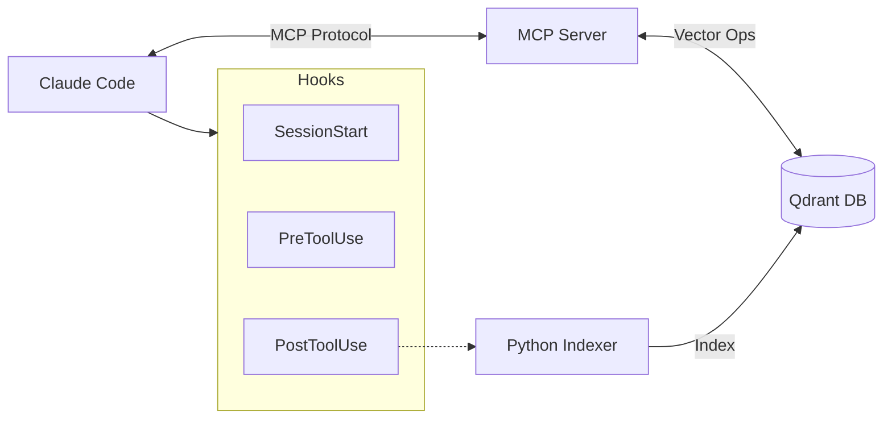
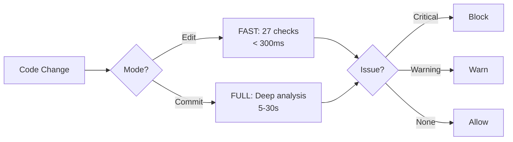
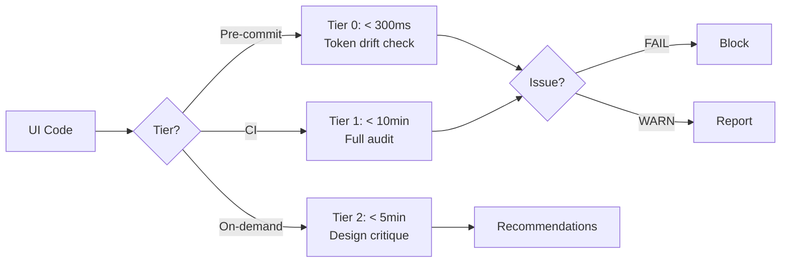

# Claude Code Memory - Transform Claude into a 10x Senior Architect

> **v2.8** | Semantic code memory for Claude Code with hybrid search, Memory Guard v4.3, and intelligent hooks



**[Architecture](ARCHITECTURE.md)** | **[Changelog](CHANGELOG.md)** | **[CLI Reference](docs/CLI_REFERENCE.md)** | **[Memory Guard](docs/MEMORY_GUARD.md)** | **[UI Consistency](docs/UI_CONSISTENCY_GUIDE.md)**

---

## Regular Claude vs God Mode Claude

**Regular Claude Code** (Without Memory):
- 🐣 "What's your project structure?" - Asked every. single. time.
- 🔄 "Let me create this function for you" - *Function already exists*
- 😴 "I don't see any similar code" - *There are 5 similar implementations*
- 🤷 "Could you show me that error handling pattern again?"
- ⏰ Wastes 10-15 minutes per session on context

**God Mode Claude** (With Memory):
- 🧙‍♂️ "I see you have 3 similar validation functions. Let me use your `validateUserInput` pattern from auth.js"
- 🎯 "This error matches the pattern you fixed in commit 3f4a2b1. Here's the same solution adapted"
- 🔮 "Based on your architecture, this belongs in `/services` with your other API handlers"
- ⚡ "Found 5 instances of this pattern. Want me to refactor them all?"
- 🚀 Starts coding immediately with full context

## Memory Guard v4.3 - 27 Checks Protecting Your Code



Memory Guard v4.3 enforces code quality through **27 pattern-based checks** across 5 categories:

| Category | Checks | Examples |
|----------|--------|----------|
| **Security** | 11 | SQL injection, XSS, secrets, crypto, logging credentials |
| **Tech Debt** | 9 | TODO/FIXME/HACK, debug statements, bare except, mutable defaults |
| **Documentation** | 2 | Missing docstrings, missing JSDoc |
| **Resilience** | 2 | Swallowed exceptions, HTTP timeouts |
| **Git Safety** | 3 | Force push, hard reset, destructive rm |

### Two-Mode Architecture

- **FAST Mode** (< 300ms): Runs during Write/Edit operations - pattern checks only
- **FULL Mode** (5-30s): Runs before commits - comprehensive AI analysis

### Watch Memory Guard in Action:

**Claude tries:** "Let me simplify this authentication function"
**Memory Guard:** "🔗 FLOW INTEGRITY ISSUE: Removing 'fallback_config' parameter breaks 8+ files!"
**Claude:** "You're right! I'll maintain backward compatibility"

#### Example 1: Code Quality Analysis in Action


#### Example 2: Preventing Critical Function Modification


#### Example 3: Security Architecture Protection


### Real-World Protection Examples:

**🔄 Code Duplication:** Prevents recreating existing functions
**🧠 Logic Completeness:** Catches SQL injection and missing validation
**🔗 Flow Integrity:** Stops breaking API changes
**⚙️ Feature Preservation:** Protects existing functionality

### Technical Magic Behind Memory Guard:

**🔍 How It Actually Works:**
1. **Intercepts Every Write/Edit** - PreToolUse hook catches all file modifications
2. **Comprehensive Analysis** - Checks all 4 quality dimensions in parallel
3. **Semantic Code Search** - Uses MCP memory to find patterns and vulnerabilities
4. **Smart Decision Making** - Returns specific issue type with actionable suggestions
5. **Manual Entry Exclusion** - Ignores documentation and human notes, focuses on code only

**🧠 The Tech Stack:**
- **Hook System**: `settings.json` → PreToolUse → `memory_guard.py` → Claude CLI
- **Entity Extraction**: Regex patterns detect new Python functions/classes being created
- **MCP Integration**: Uses `mcp__project-memory__search_similar` with entityTypes filtering
- **Claude CLI**: Isolated subprocess with `--allowedTools` limited to memory functions
- **Smart Filtering**: Skips .md, .json, .yml files - only checks actual code

**⚡ Advanced Features:**
- **Override Comments**: `# @allow-duplicate: reason` instantly bypasses analysis
- **Session Controls**: `dups off/on/status` via UserPromptSubmit hook (prompt_handler.py)
- **Per-Project State**: `.claude/guard_state.json` tracks bypass status per session
- **Debug Logging**: `memory_guard_debug.txt` in each project root
- **Graceful Degradation**: Always approves on errors - never blocks legitimate work

## UI Consistency Guard - Design System Enforcement



Prevents design system drift and enforces token usage across your codebase:

| Category | Rules | Examples |
|----------|-------|----------|
| **Token Drift** | 4 | Hardcoded colors, spacing, radius, typography |
| **Duplication** | 4 | Duplicate styles, near-duplicates, component clusters |
| **CSS Smells** | 3 | Specificity escalation, !important abuse, missing rationale |
| **Inconsistency** | 4 | Button/input/card outliers, inconsistent focus rings |

### Three-Tier Architecture

- **Tier 0** (Pre-commit): <300ms p95 - Catches token drift in changed files
- **Tier 1** (CI Audit): <10min for 1000+ files - Cross-file duplicate detection
- **Tier 2** (/redesign): <5min focused audit - Actionable design critique

### Quick Commands

```bash
# Pre-commit check (Tier 0)
claude-indexer ui-guard src/components/Button.tsx

# CI audit with SARIF for GitHub (Tier 1)
claude-indexer quality-gates run ui --format sarif -o results.sarif

# Design critique (Tier 2)
claude-indexer redesign --focus "button components"

# Baseline management
claude-indexer quality-gates baseline show
claude-indexer quality-gates baseline update
```

### Cross-Framework Detection

Detects duplicates across React, Vue, and Svelte:

```
Duplicate cluster detected:
  - src/components/Button.tsx (React)
  - src/components/VueButton.vue (Vue)
  - src/components/SvelteButton.svelte (Svelte)

Similarity: 87%
RECOMMENDATION: Extract shared design tokens
```

See [UI Consistency Guide](docs/UI_CONSISTENCY_GUIDE.md) for complete documentation.

## ⚡ Activate God Mode in 30 Seconds

### Option 1: Automated Project Setup (Recommended)
```bash
# Clone the repository
git clone https://github.com/Durafen/Claude-code-memory.git
cd Claude-code-memory

# Run automated setup for your project
./setup.sh -p /path/to/your/project -c my-project

# The script will:
# ✓ Install all dependencies (Python + Node.js packages)
# ✓ Interactively configure API keys (saved to settings.txt)
# ✓ Check/start Qdrant database via Docker
# ✓ Build MCP server with correct configuration
# ✓ Install git hooks (pre-commit, post-merge, post-checkout)
# ✓ Configure Memory Guard hooks for code quality protection
# ✓ Generate CLAUDE.md with memory-first instructions
# ✓ Run initial indexing and gather statistics
# ✓ Optional: Install global claude-indexer command

# That's it! Complete setup in one command.
```

**What you'll be asked:**
- OpenAI API Key (for chat analysis and cleanup)
- Voyage AI API Key (for embeddings - cheaper than OpenAI)
- Qdrant URL (defaults to http://localhost:6333)
- Qdrant API Key (optional, for authenticated instances)
- Whether to start Qdrant via Docker (if not running)
- Whether to install global claude-indexer command

**After setup completes:**
- Your project's CLAUDE.md contains memory usage instructions
- Git hooks automatically index on commits, pulls, and branch switches
- Memory Guard protects against duplicate code and quality issues
- MCP server configured in `.claude/settings.json`

### Option 2: Let Claude Install Everything
```
You: Install Claude Code Memory from https://github.com/Durafen/Claude-code-memory and help me understand how to use it

Claude: I'll help you install the complete Claude Code Memory system...
[Claude handles everything: clones repos, installs dependencies, configures settings, indexes your project]
```

### Option 3: Cross-Platform Automated Setup
```bash
# Handles Python/Node.js setup and dependencies automatically
# Note: Not yet tested on Windows or Linux
git clone https://github.com/Durafen/Claude-code-memory.git
cd Claude-code-memory
./install-cross-platform.sh

# Then continue from step 2 below (Configure API keys)
```

### Option 4: Manual Installation
```bash
# 1. Clone and setup
git clone https://github.com/Durafen/Claude-code-memory.git
cd Claude-code-memory
python3.12 -m venv .venv
source .venv/bin/activate  # On Windows: .venv\Scripts\activate
pip install -r requirements.txt

# 2. Configure API keys (REQUIRED - won't work without these)
cp settings.template.txt settings.txt
# Edit settings.txt and add:
# - VOYAGE_API_KEY or OPENAI_API_KEY (for embeddings)
# - QDRANT_API_KEY (if using Qdrant authentication)
# - OPENAI_API_KEY (for chat summaries and cleanup)

# 3. Install our enhanced MCP memory server
git clone https://github.com/Durafen/mcp-qdrant-memory.git
cd mcp-qdrant-memory
npm install
npm run build
cd ..

# 4. Configure MCP server environment
cd mcp-qdrant-memory
cp .env.example .env
# Edit .env and add same API keys as settings.txt
cd ..

# 5. Install global wrapper (creates claude-indexer command)
./install.sh  # On Windows: Use Git Bash or WSL
```

## 🌐 Web Explorer - Visualize Your Indexed Codebases

**Companion Project**: A beautiful web UI for exploring and visualizing your indexed codebases is available as a separate project:

🔗 **[Code Memory Explorer](https://github.com/rlefko/code-memory-explorer)**

### Features:
- **Interactive graph visualization** of code relationships
- **Semantic search** across all indexed collections
- **Code viewer** with syntax highlighting (Monaco Editor)
- **Real-time updates** via WebSockets
- **Multi-collection management** dashboard

### Quick Start:
```bash
# Clone the web explorer
git clone https://github.com/rlefko/code-memory-explorer.git
cd code-memory-explorer

# Start with Docker Compose (includes its own Qdrant if needed)
make

# Visit http://localhost:8080
```

The web explorer connects directly to your Qdrant database to visualize all indexed collections created by this indexer.

---

# 6. Install and Start Qdrant Vector Database
## Docker Installation (Recommended)
docker pull qdrant/qdrant
docker run -p 6333:6333 -p 6334:6334 -v $(pwd)/qdrant_storage:/qdrant/storage qdrant/qdrant

# Verify Qdrant is running:
curl http://localhost:6333/health

# 7. Index your project (30 seconds for most codebases)
claude-indexer -p /your/project -c my-project

# 8. Add MCP server to Claude (auto-configures from settings.txt)
claude-indexer add-mcp -c my-project
```

**That's it!** Claude now has photographic memory of your entire codebase.

## 🎯 Proven Results

- **3.99ms** semantic search across millions of lines of code
- **BM25 keyword search** for exact term matching (new in v2.8)
- **Hybrid search** combines semantic understanding + keyword precision
- **90% faster** debugging with pattern memory
- **85% cost reduction** with Voyage AI embeddings
- **95.3%** variable extraction coverage

## 🏗️ The Technology That Powers God Mode

### 🌲 Tree-sitter AST Parsing - Industry Standard Technology
**Why Tree-sitter?** The same parser that powers VS Code, GitHub, and Neovim
- **Universal AST parsing** for consistent cross-language understanding
- **36x faster** than regex with 100% semantic accuracy
- **Incremental parsing** - only re-parses what changed (15x speed boost)
- **Error recovery** - handles syntax errors gracefully

### 🚀 Multi-Language Parser Architecture
```
File → Language Detection → Tree-sitter Parser → AST → Entity Extraction
                                ↓
                          Language-Specific Parser
                          (Python: Jedi integration)
                          (JS/TS: TypeScript compiler)
                          (HTML/CSS: Component detection)
```

**Supported Languages & Coverage:**
- **Python** (.py): 100% - Functions, classes, methods, decorators, async, walrus operator
- **JavaScript** (.js, .jsx): 90.6% - Functions, classes, React components, destructuring
- **TypeScript** (.ts, .tsx): 92% - Full type extraction, interfaces, generics
- **HTML** (.html): Component detection, ID/class extraction, cross-file CSS relations
- **CSS** (.css, .scss): Selector parsing, variable extraction, @import tracking
- **JSON** (.json): Configuration semantic analysis, nested key extraction
- **YAML** (.yml, .yaml): Workflow detection (GitHub Actions), config parsing
- **Go, Rust, Java, C++**: Core function/class extraction
- **Markdown** (.md): Structure analysis, code block extraction

### 🧠 Semantic Understanding Stack
1. **AST Analysis**: Tree-sitter provides syntax tree
2. **Semantic Enhancement**: Language-specific analysis (Jedi for Python, TS compiler for TypeScript)
3. **Relation Mapping**: Cross-file imports, inheritance, function calls
4. **Knowledge Graph**: Hierarchical entity relationships
5. **Vector Embeddings**: Voyage AI code-optimized embeddings

### ⚡ Performance Architecture
- **Progressive Disclosure**: Metadata chunks (3.99ms) → Implementation on-demand
- **Smart Caching**: Frequently accessed patterns in memory
- **Incremental Updates**: SHA256 change detection, only re-index modified files
- **Parallel Processing**: Multi-threaded parsing for large codebases
- **Vector Optimization**: 512-dim Voyage AI vs 1536-dim OpenAI (3x storage savings)

## 📝 Essential Configuration

Add to your project's `CLAUDE.md`:
```markdown
## Memory Usage Instructions
You have access to a complete memory of this codebase. Before writing ANY code:
1. ALWAYS search for existing implementations first
2. Use established patterns found in memory
3. Check for duplicate functionality before creating new functions
4. When debugging, search for similar errors that were fixed before
```

## 🛠️ Memory Guard Installation

Add to your `~/.claude/settings.json`:
```json
{
  "hooks": {
    "UserPromptSubmit": [
      {
        "matcher": "",
        "hooks": [
          {
            "type": "command",
            "command": "python3 '/path/to/Claude-code-memory/utils/prompt_handler.py'"
          }
        ]
      }
    ],
    "PreToolUse": [
      {
        "matcher": "Write|Edit|MultiEdit",
        "hooks": [
          {
            "type": "command",
            "command": "python3 '/path/to/Claude-code-memory/utils/memory_guard.py'"
          }
        ]
      }
    ]
  }
}
```

## ⚙️ Memory Guard Configuration

```python
# memory_guard.py - Top of file
DEBUG_ENABLED = True                    # Toggle debug logging
DEBUG_LOG_FILE = 'memory_guard_debug.txt'  # Log filename per project
```

## 💡 How Memory Guard Protects Your Code

### Preventing Duplicate Functions
```
You: "Create a function to hash passwords"
Claude: Let me create a secure password hashing function...
Memory Guard: ❌ BLOCKED: hashPassword() already exists in auth/utils.py:45
Claude: You're right! I'll import the existing hashPassword function instead.
```

### Allowing Legitimate Similar Code
```
You: "Add password hashing to the user registration"
Claude: I'll add password hashing using your existing function...
[Claude writes: const hashedPwd = await hashPassword(password)]
Memory Guard: ✅ APPROVED - Using existing function, not creating duplicate
```

### Smart Override System
```python
# When you need a variant of existing code:
# @allow-duplicate: Specific hash function for legacy API compatibility
def hash_password_legacy(password):
    # Memory Guard sees the comment and instantly approves
```

### Session Control Commands
```
You: "dups off" (disable Memory Guard for this session)
Assistant: 🔴 Memory Guard disabled for this session

You: "dups status"
Assistant: 📊 Memory Guard Status: 🔴 DISABLED (use 'dups on' to enable)

You: "dups on" (re-enable protection)
Assistant: 🟢 Memory Guard enabled for this session
```

## 🚀 Advanced Features

### 🧠 Memory Graph Functions
**search_similar(query, entityTypes, limit, searchMode)**
- `query`: Search term or code pattern
- `entityTypes`: Filter by ["metadata", "function", "class", "debugging_pattern", "implementation"]
- `limit`: Max results (default: 50)
- `searchMode`: "hybrid" (semantic+keyword), "semantic", "keyword" (BM25)

**read_graph(entity, mode, limit, entityTypes)**
- `entity`: Specific component name for focused view
- `mode`: "smart" (AI summary), "entities", "relationships", "raw"
- `limit`: Max items (smart=150, others=300)
- `entityTypes`: Filter results by type

**get_implementation(entityName, scope)**
- `entityName`: Function/class name
- `scope`: "minimal" (just code), "logical" (+ helpers), "dependencies" (+ imports)

### 📊 Manual Memory Categories (9-System)
- `debugging_pattern` (30%): Bug solutions and fixes
- `implementation_pattern` (25%): Code patterns and algorithms
- `integration_pattern` (15%): API/database integrations
- `configuration_pattern` (12%): Setup and deployment
- `architecture_pattern` (10%): System design decisions
- `performance_pattern` (8%): Optimization techniques
- `knowledge_insight`: Research findings
- `active_issue`: Current bugs (delete when fixed)
- `ideas`: Feature suggestions

### 🎯 Progressive Disclosure Architecture
- **Metadata chunks**: Fast 3.99ms initial search
- **Implementation chunks**: Full code on-demand
- **90% speed boost**: Search metadata first, load code when needed
- **Token optimization**: Smart 25k token responses vs 393k overwhelming dumps

### Cost-Optimized Embeddings
```bash
# Voyage AI - 85% cheaper, code-optimized
VOYAGE_API_KEY=your_key
EMBEDDING_PROVIDER=voyage
EMBEDDING_MODEL=voyage-3-lite

# OpenAI - Industry standard
OPENAI_API_KEY=your_key
EMBEDDING_PROVIDER=openai
EMBEDDING_MODEL=text-embedding-3-small
```

## 📋 CLI Commands Reference

### Core Indexing
```bash
claude-indexer -p . -c my-project                       # Index current directory
claude-indexer -p /path/to/project -c collection-name   # Index specific project
claude-indexer -p . -c my-project --verbose            # Detailed progress output
claude-indexer -p . -c my-project --clear              # Clear + reindex (preserves manual)
claude-indexer add-mcp -c my-project                   # Configure Claude MCP connection
```

### Real-time Operations
```bash
claude-indexer watch start -p . -c my-project          # File watching current directory
claude-indexer search "authentication" -p . -c my-project --type entity  # Search with filters
claude-indexer search "login function" -p . -c my-project --mode keyword  # BM25 keyword search
claude-indexer search "auth pattern" -p . -c my-project --mode hybrid     # Combined search
claude-indexer file ./src/auth.py -p . -c my-project   # Index single file
```

### Service Management
```bash
claude-indexer service start                           # Multi-project background service
claude-indexer service add-project /path/to/project my-project  # Add project (positional args)
claude-indexer service status                          # Check service health
```

### Git Integration (Requires both -p and -c)
```bash
claude-indexer hooks install -p . -c my-project        # Pre-commit auto-indexing
claude-indexer hooks status -p . -c my-project         # Check hook status
claude-indexer hooks uninstall -p . -c my-project      # Remove git hooks
```

### Memory Management
```bash
python utils/manual_memory_backup.py backup -c my-project        # Backup manual entries
python utils/manual_memory_backup.py restore -f backup.json      # Restore from backup
python utils/qdrant_stats.py -c my-project --detailed           # Collection health stats
```

### Chat Analysis (v2.3+)
```bash
claude-indexer chat index -p . -c my-project --limit 50         # Process chat history
claude-indexer chat search "debugging patterns" -p . -c my-project  # Search chat insights
claude-indexer chat html-report -p . -c my-project              # Generate HTML report
```

## 🎯 Prerequisites

**Required Software:**
- Python 3.9+ (3.12+ recommended) - [Download](https://python.org)
- Node.js 18+ - [Download](https://nodejs.org)
- Claude Code installed - [Get Claude](https://claude.ai/download)
- Docker (for Qdrant) - [Get Docker](https://docker.com/get-started)

**API Keys Needed:**
- **Embeddings**: Voyage AI key (recommended) OR OpenAI key
- **Chat Analysis**: OpenAI key (for GPT-4.1-mini)
- **Qdrant**: API key (only if authentication enabled)

**Quick Prerequisites Check:**
```bash
python3 --version  # Should be 3.9+
node --version     # Should be 18+
docker --version   # Any recent version
claude --version   # Claude Code CLI
```

## 🏗️ Architecture

```
┌─────────────────┐    ┌──────────────────┐    ┌─────────────────┐
│   Claude Code   │◄──►│  Enhanced MCP    │◄──►│   Qdrant DB     │
│                 │    │     Server       │    │   (Vectors)     │
└─────────────────┘    └──────────────────┘    └─────────────────┘
                                                        ▲
                       ┌────────────────┐               │
                       │ Tree-sitter +  │───────────────┘
                       │     Jedi       │
                       └────────────────┘
```

## 📚 Documentation

- [CLAUDE.md](CLAUDE.md) - Comprehensive setup and architecture details
- [Installation Guide](docs/installation.md) - Platform-specific setup
- [Memory Functions](docs/memory-functions.md) - Advanced memory usage
- [Troubleshooting](docs/troubleshooting.md) - Common issues and solutions
- [UI Consistency Guide](docs/UI_CONSISTENCY_GUIDE.md) - Design system enforcement
- [UI CI Setup](docs/UI_CI_SETUP.md) - CI integration for UI quality

## 🔧 Common Setup Issues

### "claude-indexer: command not found"
```bash
# Re-run the installer
./install.sh
# Or manually add to PATH:
export PATH="$PATH:$HOME/Claude-code-memory"
```

### API Key Errors
- **"Invalid API key"**: Check settings.txt has correct keys
- **"Embedding provider mismatch"**: Ensure MCP .env matches settings.txt
- **"No results found"**: Verify same embedding provider for indexing and searching

### Qdrant Connection Failed
```bash
# Check if Qdrant is running
curl http://localhost:6333/health
# If not, restart Docker:
docker run -p 6333:6333 -v $(pwd)/qdrant_storage:/qdrant/storage qdrant/qdrant
```

### Memory Guard Not Working
- Ensure both hooks are in `~/.claude/settings.json` (UserPromptSubmit + PreToolUse)
- Check `memory_guard_debug.txt` in your project root
- Verify project has a valid MCP collection configured
- Check your project's `CLAUDE.md` contains the MCP collection name (e.g., `mcp__project-name-memory__`)
- Memory Guard auto-detects collection from CLAUDE.md - without it, uses generic name

## 🔧 Automation Features

### Gitignore Pattern Detection
The system automatically detects and excludes files from your `.gitignore`:

```python
# Utility: utils/gitignore_parser.py
from utils.gitignore_parser import get_patterns_for_project

# Automatically excludes build artifacts, dependencies, generated files
patterns = get_patterns_for_project('/path/to/project')
# Returns: ['.git/', 'node_modules/', 'dist/', '__pycache__/', ...]
```

**Benefits:**
- No manual exclude configuration needed
- Respects project-specific .gitignore patterns
- Combines with sensible defaults (`.git/`, `.claude-indexer/`, build outputs)
- Prevents indexing of generated code and dependencies

### CLAUDE.md Template System
Automatically generates project-specific documentation:

```bash
# Template location: templates/CLAUDE.md.template
# Generated during setup with substituted variables:
# - {{PROJECT_NAME}}: Auto-detected from folder
# - {{COLLECTION_NAME}}: User-specified or auto-detected
# - {{VECTOR_COUNT}}: Post-indexing statistics
# - {{FILE_COUNT}}: Total files indexed
# - {{PROJECT_PATH}}: Absolute path
# - {{GENERATION_DATE}}: Setup timestamp
```

**What gets generated:**
- Memory-first workflow instructions
- Quick command reference with correct MCP tool names
- Memory entity types documentation
- Memory Guard configuration guide
- Git hooks information
- Manual re-index instructions

### Automatic Git Hooks
Three hooks installed automatically during setup:

**pre-commit**: Indexes changed files before each commit
```bash
# Runs before: git commit
# Effect: New code immediately available in memory
```

**post-merge**: Updates index after pulls and merges
```bash
# Runs after: git pull, git merge
# Effect: Incoming code changes indexed automatically
```

**post-checkout**: Re-indexes when switching branches
```bash
# Runs after: git checkout <branch>
# Effect: Memory reflects current branch state
```

All hooks use absolute paths and graceful error handling (never block git operations).

### Memory Guard Auto-Configuration
Automatically configured during setup:

```json
// Project-local .claude/settings.json
{
  "hooks": {
    "UserPromptSubmit": [...],  // Session control (dups on/off)
    "PreToolUse": [...]          // Code quality gate
  }
}
```

**Protection Layers:**
- Duplicate code detection
- Missing error handling detection
- Breaking API change prevention
- Feature preservation checks

## Claude Code Hooks

The hook system automates memory operations at key workflow points:

| Hook | File | Trigger | Purpose | Latency |
|------|------|---------|---------|---------|
| **SessionStart** | `session_start.py` | Session begins | Git context + memory reminder | < 100ms |
| **UserPromptSubmit** | `prompt_handler.py` | Before Claude processes | Intent detection, tool suggestions | < 50ms |
| **PreToolUse** | `pre-tool-guard.sh` | Before Write/Edit/Bash | Memory Guard quality checks | < 300ms |
| **PostToolUse** | `post-file-change.sh` | After Write/Edit | Auto-index changed files | ~100ms |

### Batch Indexing (New in v2.8)

Git hooks now use batch indexing for **4-15x faster** performance:

```bash
# Old: Sequential (60s for 10 files)
for file in $CHANGED_FILES; do
    claude-indexer file "$file" ...  # 6s each
done

# New: Batch (5s for 10 files)
echo "$CHANGED_FILES" | claude-indexer index --files-from-stdin ...
```

| Files Changed | Sequential | Batch | Speedup |
|---------------|------------|-------|---------|
| 1 | 3s | 3s | 1x |
| 5 | 15s | 4s | 4x |
| 10 | 30s | 5s | 6x |
| 50 | 150s | 10s | 15x |

---

## Performance Benchmarks

| Operation | Latency | Notes |
|-----------|---------|-------|
| Metadata search | **3-5ms** | Progressive disclosure default |
| Full entity search | 50-80ms | With implementation details |
| Single file index | 100-300ms | Depends on file complexity |
| Batch index (100 files) | 10-20s | Parallel processing |
| Memory Guard (FAST) | 150-250ms | 27 pattern checks |
| Hybrid search | 30-50ms | Semantic + BM25 combined |

### Scaling Characteristics

| Metric | Capacity |
|--------|----------|
| Vectors per collection | 100,000+ |
| Files per project | 10,000+ |
| Concurrent searches | 100+ |
| Embedding batch size | 100 entities |

---

## Contributing

**Found a bug?** [Report it here](https://github.com/Durafen/Claude-code-memory/issues)
**Want a feature?** [Request it here](https://github.com/Durafen/Claude-code-memory/issues)
**Have feedback?** [Start a discussion](https://github.com/Durafen/Claude-code-memory/discussions)

## 🎉 Start Your God Mode Journey

Transform Claude from a talented junior into your most senior team member. Give it the superpower of perfect memory and watch it reference your code like it's been on your team for years.

**One command. 30 seconds. Claude becomes omniscient.**
